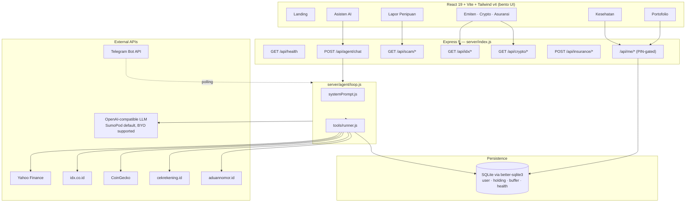

# Vnansial

[](LICENSE)

**Platform literasi keuangan all-in-one untuk Indonesia.** Skor kesehatan
finansial, saham IDX, crypto, asuransi, portofolio, pinjaman, cek
rekening + nomor penipu, dan asisten AI dengan tool-calling — semuanya
dalam satu antarmuka tenang ala Apple, bento style, hijau alam. Open
source, self-hostable, gratis.

> *Jangan sampai uangmu hilang karena kurang informasi.*

**🌱 Live demo:** **https://vnansial.mukhayyar.my.id/**
**Repo:** https://github.com/mukhayyar/OpenClaw2026_BRBSolo_vnansial
**Team:** BRBSolo · OpenClaw Agenthon 2026

**Docs for contributors:** [`CLAUDE.md`](CLAUDE.md) · [`AGENTS.md`](AGENTS.md) · [`CONTRIBUTING.md`](CONTRIBUTING.md) · [`ARCHITECTURE.md`](ARCHITECTURE.md) · [`DEPLOYMENT.md`](DEPLOYMENT.md) · [`presentation.md`](presentation.md)

---

## What's inside

| Domain | Page | What it does |
|--------|------|--------------|
| **Diagnosis** | `/kesehatan` | 0–100 financial-wellness score from 4 pillars (budget, emergency fund, debt, savings) |
| **IDX saham** | `/emiten` | Cek emiten Indonesia: profil, dividen, ESG, pemegang saham, kalender |
| **Crypto** | `/crypto` | Live CoinGecko + scam-risk heuristic (umur, market cap, volume, daftar scam) |
| **Asuransi** | `/asuransi` | Bandingkan BPJS, Prudential, AIA, Allianz, Manulife, Sinar Mas, Garda Oto, AXA Mandiri + premium calculator + rekomendasi personal |
| **Portofolio** | `/portofolio` | Saham, crypto, reksadana, obligasi, logam — **live price**, cost-basis, gain/loss. Dana darurat, money buffer, tabungan tujuan (custom + isComplete/isUsed), cashflow harian |
| **Edukasi** | `/edukasi` | Sub-tab: Quiz, Tips, **Kalkulator pinjaman** (anuitas vs flat, KUR vs pinjol vs rentenir) |
| **Verifikasi** | `/cek-investasi` | Cek izin OJK + checklist 8 red-flag investasi bodong |
| **Rencana** | `/rencana-investasi` | Target tabungan, alokasi aset, harga pasar Yahoo Finance |
| **Lapor** | `/lapor` | Cek rekening (cekrekening.id) + cek nomor HP (aduannomor.id) + 5-step panduan lapor + 5 hotline + template surat |
| **Asisten AI** | `/asisten` | Chat dengan tool calling (16 tool). Bisa baca/tulis portofolio kamu (PIN-gated). |
| **Telegram bot** | env-gated | `/score /quote /crypto /emiten /ask /portofolio` — opsional |

---

## Why this exists (the personal story)

Lihat **[`presentation.md`](presentation.md) Slide 1.5** untuk cerita lengkap.
Singkatnya: dibangun oleh mahasiswa tahun akhir yang panik soal keuangan
sendiri, lalu sadar separuh Indonesia di posisi yang sama. Vnansial adalah
"app yang dulu pengen gue download umur 18."

---

## OpenClaw Agenthon 2026 — compliance

| Requirement | Status | Where in code |
|-------------|--------|----------------|
| **Tool calling** | ✅ | `server/agent/loop.js` — OpenAI-compatible `tools` + `tool` role messages |
| **Autonomous loop** | ✅ | Up to 8 LLM↔tool rounds per chat request, tanpa interaksi user di tengah |
| **Multi-tool agent** | ✅ | 18 tools registered: health, IDX (4), crypto (2), insurance (3), OJK, loan, fraud guide, market (2), allocation, portfolio (4), scam-check (2) |
| **Live demo deployable** | ✅ | https://vnansial.mukhayyar.my.id/ |
| **Not a basic chatbot** | ✅ | Agent invokes IDX, CoinGecko, scam DB, SQLite portfolio CRUD dynamically |
| **Open source** | ✅ | Apache 2.0, self-hostable, BYO AI provider |

---

## Architecture



---

## AI providers — bring your own

Default = **SumoPod** (Indonesian inference, free credits, low latency for
ID users). The OpenAI SDK shim accepts any compatible endpoint:

| Provider | Set in `.env` |
|----------|---------------|
| SumoPod (default) | `SUMOPOD_BASE_URL=https://ai.sumopod.com/v1` `SUMOPOD_MODEL=qwen3.6-flash` |
| OpenAI | `SUMOPOD_BASE_URL=https://api.openai.com/v1` `SUMOPOD_MODEL=gpt-4o-mini` |
| OpenRouter | `SUMOPOD_BASE_URL=https://openrouter.ai/api/v1` `SUMOPOD_MODEL=anthropic/claude-3.5-haiku` |
| Local Ollama | `SUMOPOD_BASE_URL=http://localhost:11434/v1` `SUMOPOD_MODEL=llama3.2` |
| Any OpenAI-compatible | …same pattern |

The `SUMOPOD_*` env names are historical; treat them as `LLM_*`.

---

## Privacy: PIN-gated personal data

Personal endpoints (`/api/me/*`) and SQLite-backed agent tools (portfolio
CRUD, health snapshots) require a PIN match against `VNANSIAL_PIN` in
`.env`. The web client stores the PIN only in `sessionStorage` (cleared
when the tab closes). The PIN is **never** sent to the LLM as part of the
conversation — the server injects it server-side into tool args and
redacts it from the chat log.

Without a PIN configured, the app runs in **dev mode** (open), with a
warning at startup. Always set a PIN in production.

---

## Quick start

```bash
git clone https://github.com/mukhayyar/OpenClaw2026_BRBSolo_vnansial.git vnansial
cd vnansial
cp .env.example .env       # fill SUMOPOD_API_KEY + VNANSIAL_PIN
npm install
npm install better-sqlite3 # optional — enables persistence
npm run dev
```

| Service | URL |
|---------|-----|
| Frontend (Vite) | http://localhost:5173 |
| API | http://localhost:3001 |
| Health | http://localhost:3001/api/health |

Production build:

```bash
npm run build
npm start
# Single port → http://localhost:3001
```

---

## Docker

### Pull from GitHub Container Registry (recommended)

```bash
# Latest main
docker pull ghcr.io/mukhayyar/vnansial:latest

# Custom env via CLI flags (no .env file needed)
docker run -d --name vnansial \
  -p 3001:3001 \
  -v vnansial_data:/data \
  -e SUMOPOD_API_KEY=sk-your-key \
  -e VNANSIAL_PIN=842913 \
  -e VNANSIAL_DB_PATH=/data/vnansial.db \
  -e TELEGRAM_BOT_TOKEN=optional-token \
  --restart unless-stopped \
  ghcr.io/mukhayyar/vnansial:latest

# Or with an env file (anywhere on disk)
docker run -d --name vnansial -p 3001:3001 \
  -v vnansial_data:/data \
  --env-file /etc/vnansial.env \
  --restart unless-stopped \
  ghcr.io/mukhayyar/vnansial:latest
```

CI publishes multi-arch (amd64 + arm64) images on every push to `main`
and on tagged releases (`v1.2.3`). See [`.github/workflows/release.yml`](.github/workflows/release.yml).

### Build locally

```bash
docker compose up -d
# Persistent volume: vnansial_data → /data (SQLite lives here)
# Health probe built into the container
```

See [`docker-compose.yml`](docker-compose.yml) and [`Dockerfile`](Dockerfile).
The Dockerfile compiles `better-sqlite3` from source so persistence works
out of the box.

For VPS deployment (Sumopod, Jetorbit, generic Ubuntu) see
[`DEPLOYMENT.md`](DEPLOYMENT.md).

---

## Environment variables

| Variable | Required | Description |
|----------|----------|-------------|
| `SUMOPOD_API_KEY` | **Yes** | API key for any OpenAI-compatible provider |
| `SUMOPOD_BASE_URL` | No | Provider base URL (default SumoPod) |
| `SUMOPOD_MODEL` | No | Default `qwen3.6-flash` |
| `VNANSIAL_PIN` | **Recommended** | Locks `/api/me/*` and SQLite agent tools |
| `VNANSIAL_DB_PATH` | No | Override SQLite location |
| `TELEGRAM_BOT_TOKEN` | No | Activates Telegram polling bot |
| `YAHOO_MOCK` | No | `1` for offline/CI mocks |
| `PORT` | No | Default `3001` |
| `VITE_API_URL` | No | Leave empty in dev (Vite proxies `/api`) |

Never commit `.env`. See [`.env.example`](.env.example).

---

## API reference (excerpt)

### Public

- `GET /api/health` — health + driver state
- `GET /api/agent/test` — ping the LLM
- `GET /api/market/{quote,search,history}` — Yahoo Finance
- `GET /api/idx/emiten` — list emiten (live or curated fallback)
- `GET /api/idx/{profile,dividen,financial,esg,pemegang,calendar}/:code`
- `GET /api/idx/:code` — composite overview
- `GET /api/crypto/{top,coin,risk}` — CoinGecko + scam scoring
- `GET /api/scam/{rekening,nomor}` — cekrekening.id / aduannomor.id
- `GET /api/insurance` + `POST /api/insurance/{premium,recommend}`
- `POST /api/health/score` — stateless scoring (no PIN)
- `POST /api/me/auth/check` — PIN verification

### PIN-gated (`x-vnansial-pin` header required when `VNANSIAL_PIN` is set)

- `POST /api/me/health` — save health snapshot
- `GET /api/me/health/history`
- `GET /api/me/portfolio`
- `POST/DELETE /api/me/portfolio/holding`
- `POST /api/me/portfolio/buffer`

### Agent chat

`POST /api/agent/chat` with body `{ messages, pin? }` or `x-vnansial-pin`
header. Returns `{ message, toolCalls, model }`.

---

## Tests

```bash
npm test       # vitest run — 32+ cases across server tools
```

---

## Tech stack

| Layer | Technology |
|-------|------------|
| UI | React 19, React Router 7, Framer Motion, Tailwind CSS 4 |
| Build | Vite 8, TypeScript |
| API | Express 5, CORS, ESM |
| AI | `openai` SDK — any OpenAI-compatible provider (SumoPod default) |
| Persistence | `better-sqlite3` (optional, with in-memory fallback) |
| Market data | Yahoo Finance (`yahoo-finance2`), CoinGecko, IDX proxy |
| Scam DB | cekrekening.id, aduannomor.id |
| Messaging | Telegram Bot API (polling, optional) |
| Deploy | Docker / docker-compose / VPS + systemd + nginx |

---

## Contributing

Read [`CONTRIBUTING.md`](CONTRIBUTING.md). New tools / pages must follow
the pattern documented in [`CLAUDE.md`](CLAUDE.md) (canonical) or
[`AGENTS.md`](AGENTS.md) (non-Claude AI agents).

Plan-driven workflow: `.plan/*.plan` + `.progress/*.progress` files
narrate in-flight work so AI agents and humans can hand off cleanly.

---

## License

Apache 2.0. See [`LICENSE`](LICENSE).
