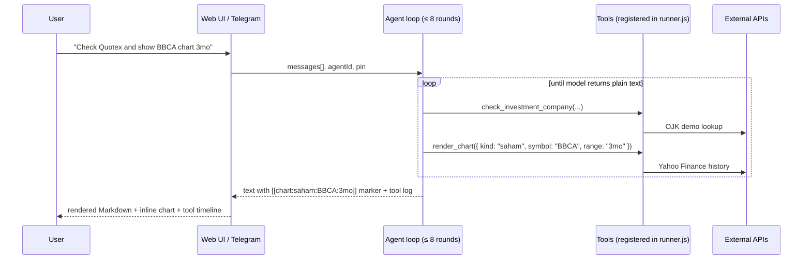

# Vnansial

[](LICENSE)
[](https://vnansial.mukhayyar.my.id/)
[](https://github.com/mukhayyar/OpenClaw2026_BRBSolo_vnansial/pkgs/container/vnansial)

> **An AI Agent with a Web UI for Indonesian personal finance.** One
> conversational assistant that can verify investments, screen scam
> bank accounts and phone numbers, check IDX stocks, score crypto
> projects, compare insurance, manage your portfolio in SQLite, set
> alerts, schedule reminders, and render trading charts — across web
> *and* Telegram.

**Live demo:** [https://vnansial.mukhayyar.my.id/](https://vnansial.mukhayyar.my.id/)

---

## 🤖 AI Agent with Web UI — the headline

Vnansial is built around an **autonomous tool-calling agent** that the
user talks to in a chat. The web UI is a beautifully designed companion
surface, not the main event. The agent can:

| Capability | Tool name |
|------------|-----------|
| Verify if a company is OJK-licensed | `check_investment_company` |
| Check a suspicious bank account number (cekrekening.id) | `check_bank_account_report` |
| Check a suspicious phone number (aduannomor.id) | `check_phone_number_report` |
| Score the risk of any crypto (CoinGecko + heuristic) | `assess_crypto_scam_risk` |
| Score DEX / meme coin risk (DexScreener) | `assess_dex_token` |
| Pull full IDX company profile, dividends, ESG, financials | `get_idx_company`, `get_idx_dividen`, `get_idx_financial` |
| Run a 0–100 financial-wellness score on your numbers | `score_financial_health` |
| Calculate loan installments, compare predatory rates | `calculate_loan` |
| Recommend insurance products, calculate premiums | `recommend_insurance`, `calculate_insurance_premium` |
| Read & write your personal portfolio in SQLite | `get_user_portfolio`, `add_portfolio_holding`, … |
| Render a live trading chart inline in chat | `render_chart` |
| Create price alerts (cron daemon notifies on Telegram) | `create_price_alert` |
| Schedule natural-language reminders | `create_reminder` |
| Delegate a question to a specialist agent | `ask_other_agent` |

There are **6 predefined agent personalities** (Generalist, Beginner
Coach, Investment Analyst, Fraud Detective, Insurance Consultant,
Wellness Coach) plus **custom agents** with user-defined prompts —
all selectable from a dropdown in the chat.

### How the agent works (visible to the user)



**Visible tool-call timeline** in chat — perfect for demos. Every tool
invocation shows up as a numbered badge under the assistant message,
animated in as it runs. In Telegram, the bot sends an immediate
"⏳ Thinking…" message and **edits it live** with each tool name as
it executes (🔧 → ✅), then replaces the message with the final answer.
Charts arrive as real PNG images.

---

## Web UI — a calm bento surface

Apple-inspired, white + green, landscape-anchored. Twelve first-class
pages, no neon, no clutter:

| Route | Page | What it does |
|-------|------|--------------|
| `/` | Landing | Hero + bento navigation grid (logo click reopens it) |
| `/kesehatan` | Financial Wellness Score | 0–100 from 4 pillars (budget, emergency fund, debt, savings) |
| `/emiten` | IDX Stock Lookup | Profile, dividend history, ESG, large shareholders + live Yahoo chart |
| `/crypto` | CryptoWatch | CoinGecko top + search any coin (including meme via DexScreener) + scam risk |
| `/asuransi` | Insurance Compare | BPJS / Prudential / AIA / Allianz / Manulife / Sinar Mas / Garda Oto / AXA Mandiri |
| `/portofolio` | Portfolio Tracker | Stocks/crypto/mutual funds/bonds/gold with **live prices** + cost basis + gain/loss, emergency fund, money buffer, custom savings goals (with `isComplete` / `isUsed`), daily cashflow ledger |
| `/edukasi` | Education | Sub-tabs: Quiz, Tips, Loan Calculator (predatory rate detector) |
| `/cek-investasi` | OJK Check | Verify license + 8-point red-flag checklist |
| `/lapor` | Scam Reporting | Cek rekening (cekrekening.id) + cek nomor HP (aduannomor.id) + 5-step report guide + 5 hotlines + letter templates |
| `/rencana-investasi` | Investment Plan | Target savings, asset allocation, Yahoo Finance quotes |
| `/asisten` | AI Assistant | Full chat with agent dropdown, session picker, `.md` export |
| `/settings` | Settings | Masked Telegram token, PIN-gated edits, custom agent CRUD, default-agent picker |

---

## Provider-agnostic AI

We default to **SumoPod** (Indonesian inference, free credits, low
latency for ID users) but the OpenAI SDK shim accepts any compatible
endpoint:

| Provider | `.env` example |
|----------|----------------|
| SumoPod (default) | `SUMOPOD_BASE_URL=https://ai.sumopod.com/v1` `SUMOPOD_MODEL=qwen3.6-flash` |
| OpenAI | `SUMOPOD_BASE_URL=https://api.openai.com/v1` `SUMOPOD_MODEL=gpt-4o-mini` |
| OpenRouter | `SUMOPOD_BASE_URL=https://openrouter.ai/api/v1` `SUMOPOD_MODEL=anthropic/claude-3.5-haiku` |
| Local Ollama | `SUMOPOD_BASE_URL=http://localhost:11434/v1` `SUMOPOD_MODEL=llama3.2` |
| Any OpenAI-compatible | Same pattern |

The env names are historical (`SUMOPOD_*`) — treat them as `LLM_*`.

---

## Privacy: PIN-gated personal data

Anything that touches your portfolio or financial history requires a
PIN match against `VNANSIAL_PIN` in `.env`. The web client stores the
PIN only in `sessionStorage` (cleared when the tab closes). **The PIN
is never sent to the LLM as conversation content** — the server injects
it server-side into tool args and redacts it from chat logs.

When `VNANSIAL_PIN` is empty, the server runs in **open dev mode** with
a warning at startup. Always set a PIN in production.

---

## Quick start — local dev

```bash
git clone https://github.com/mukhayyar/OpenClaw2026_BRBSolo_vnansial.git vnansial
cd vnansial
cp .env.example .env       # set SUMOPOD_API_KEY + VNANSIAL_PIN
npm install
npm install better-sqlite3 # optional — enables persistence
npm run dev
```

| Service | URL |
|---------|-----|
| Frontend (Vite) | http://localhost:5173 |
| API | http://localhost:3001 |
| Health | http://localhost:3001/api/health |

Production:

```bash
npm run build
npm start                  # single port → http://localhost:3001
```

---

## Docker — pull from GitHub Container Registry

CI publishes multi-arch (amd64 + arm64) images on every push to `main`
and on tagged releases.

```bash
# Latest from main
docker pull ghcr.io/mukhayyar/vnansial:latest

# Specific version
docker pull ghcr.io/mukhayyar/vnansial:0.3.2

# Run with env via CLI (no .env file needed)
docker run -d --name vnansial \
  -p 3001:3001 \
  -v vnansial_data:/data \
  -e SUMOPOD_API_KEY=sk-your-key \
  -e VNANSIAL_PIN=842913 \
  -e VNANSIAL_DB_PATH=/data/vnansial.db \
  -e TELEGRAM_BOT_TOKEN=optional-bot-token \
  --restart unless-stopped \
  ghcr.io/mukhayyar/vnansial:latest

# Or with an env file
docker run -d --name vnansial -p 3001:3001 \
  -v vnansial_data:/data \
  --env-file /etc/vnansial.env \
  --restart unless-stopped \
  ghcr.io/mukhayyar/vnansial:latest
```

Or build locally:

```bash
docker compose up -d
```

See [`docker-compose.yml`](docker-compose.yml) and the
[`.github/workflows/release.yml`](.github/workflows/release.yml) build
recipe. For VPS deployment (Sumopod / Jetorbit / generic Ubuntu) see
[`DEPLOYMENT.md`](DEPLOYMENT.md).

---

## Telegram bot

Optional — activate with `TELEGRAM_BOT_TOKEN` in `.env`. Once set,
restart the server, then:

1. Open your bot in Telegram, send `/start` — your chat is bound to
   your local user account.
2. The cron daemon will deliver **price alerts** and **reminders** to
   that chat automatically.
3. Send any message → the bot replies with a **progressive status
   message** that edits in-place as the agent runs each tool, then
   ends with the final answer in Markdown + chart images.

Commands: `/score /quote SYMBOL /crypto ID /emiten KODE /ask QUESTION
/sessions /continue NUM /alerts /reminders /bind`.

---

## Environment variables

| Variable | Required | Description |
|----------|----------|-------------|
| `SUMOPOD_API_KEY` | **Yes** | API key for any OpenAI-compatible provider |
| `SUMOPOD_BASE_URL` | No | Provider base URL (default SumoPod) |
| `SUMOPOD_MODEL` | No | Default `qwen3.6-flash` |
| `VNANSIAL_PIN` | **Recommended** | Locks `/api/me/*` and SQLite agent tools |
| `VNANSIAL_DB_PATH` | No | Override SQLite location |
| `TELEGRAM_BOT_TOKEN` | No | Activates the polling bot + alert/reminder delivery |
| `VNANSIAL_USE_PUPPETEER` | No | Enable Puppeteer fallback for IDX bypass (install deps separately) |
| `YAHOO_MOCK` | No | `1` for offline / CI fixtures |
| `PORT` | No | Default `3001` |
| `VITE_API_URL` | No | Leave empty when web + API share an origin |

Never commit `.env`. See [`.env.example`](.env.example).

---

## API reference (excerpt)

### Public

- `GET /api/health` — service + driver status
- `GET /api/agent/test` — ping the LLM
- `GET /api/market/{quote,search,history}` — Yahoo Finance
- `GET /api/idx/emiten` — list emiten (live or curated fallback)
- `GET /api/idx/{profile,dividen,financial,esg,pemegang,calendar}/:code`
- `GET /api/idx/:code` — composite overview
- `GET /api/crypto/{top,coin,risk,search,history}` — CoinGecko
- `GET /api/dex/{search,assess}` — DexScreener (meme / DEX tokens)
- `GET /api/scam/{rekening,nomor}` — cekrekening.id / aduannomor.id
- `GET /api/insurance` + `POST /api/insurance/{premium,recommend}`
- `POST /api/health/score` — stateless scoring (no PIN)
- `POST /api/me/auth/check` — PIN verification

### PIN-gated (`x-vnansial-pin` header required when `VNANSIAL_PIN` is set)

- `POST /api/me/health` — save snapshot
- `GET /api/me/health/history`
- `GET /api/me/portfolio`
- `POST/DELETE /api/me/portfolio/holding`
- `POST /api/me/portfolio/buffer`
- `GET/POST/PATCH/DELETE /api/sessions[/:id]`
- `GET /api/sessions/:id/messages`
- `GET /api/sessions/:id/export` (Markdown export)
- `GET /api/agents`, `POST/DELETE /api/agents[/:id]`
- `GET/POST /api/me/settings`
- `GET/POST/DELETE /api/me/alerts[/:id]`

### Agent chat

`POST /api/agent/chat` with `{ messages, pin?, agentId?, sessionId? }`
or `x-vnansial-pin` header. Returns `{ message, toolCalls, agentId,
model }`.

---

## Architecture

```
   Browser  ────► React 19 + Vite + Tailwind v4 (bento UI)
                  │
                  │ JSON over /api
                  ▼
   Express 5  ────►  IDX proxy (cookie-warmed) ──► idx.co.id
                ────►  CoinGecko + DexScreener  ──► api.coingecko.com / dexscreener
                ────►  Yahoo Finance (cached)   ──► yahoo-finance2
                ────►  Scam DB                   ──► cekrekening.id / aduannomor.id
                ────►  Tool-calling loop (≤ 8 iterations)
                       │
                       ├─► onProgress hook → Telegram message edits
                       └─► Charts → QuickChart.io PNG URL
                ────►  PIN-gated /api/me/*       ──► SQLite (better-sqlite3)
                ────►  Cron daemon               ──► every 30s
                       │
                       ├─► Price alerts → Telegram
                       └─► Reminders     → Telegram
                ────►  Telegram bot (polling, optional)
```

SQLite tables: `user`, `health_snapshot`, `holding`, `buffer`,
`session`, `message`, `agent`, `settings`, `alert`, `reminder`.
Graceful in-memory fallback when `better-sqlite3` isn't installed.

---

## Tests & build

```bash
npm test       # vitest run — 32+ cases
npm run build  # vite build → dist/ (~500 KB → 150 KB gzip)
```

---

## Tech stack

| Layer | Technology |
|-------|------------|
| UI | React 19, React Router 7, Framer Motion, Tailwind CSS 4 |
| Build | Vite 8, TypeScript |
| API | Express 5, CORS, ESM |
| AI | `openai` SDK — any OpenAI-compatible provider |
| Persistence | `better-sqlite3` (optional, with in-memory fallback) |
| Markets | Yahoo Finance (`yahoo-finance2`), CoinGecko, DexScreener, IDX proxy |
| Scam DB | cekrekening.id, aduannomor.id |
| Messaging | Telegram Bot API (polling) |
| Charts | Inline SVG (web) + QuickChart.io PNG (Telegram) |
| Deploy | Docker / docker-compose / ghcr.io multi-arch |

---

## Contributing

Read [`CONTRIBUTING.md`](CONTRIBUTING.md). New tools / pages must
follow the pattern documented in [`CLAUDE.md`](CLAUDE.md) (canonical)
or [`AGENTS.md`](AGENTS.md) (non-Claude AI coding agents).

Plan-driven workflow: `.plan/*.plan` + `.progress/*.progress` files
narrate in-flight work so AI agents and humans can hand off cleanly.

---

## OpenClaw Agenthon 2026

| Criterion | Status |
|-----------|--------|
| Tool calling | ✅ 30+ tools registered |
| Autonomous loop | ✅ up to 8 LLM↔tool rounds per request |
| Multi-tool agent | ✅ |
| Multi-agent presets + custom | ✅ |
| Live demo deployable | ✅ https://vnansial.mukhayyar.my.id/ |
| Open source | ✅ Apache 2.0, self-hostable, BYO AI provider |

---

## License

Apache 2.0. See [`LICENSE`](LICENSE).
