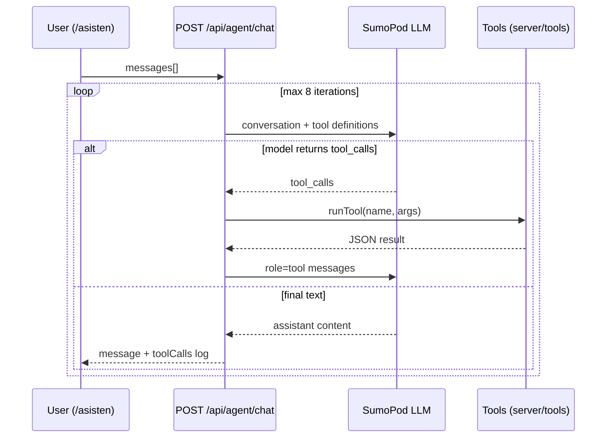
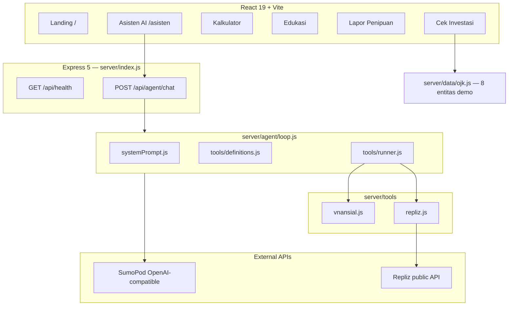

# Vnansial

**Multi-tool AI financial guardian for Indonesia** — literasi keuangan, cek investasi bodong, kalkulator pinjaman, dan asisten AI dengan **tool calling** (SumoPod).

> *Jangan sampai uangmu hilang karena kurang informasi.*

**OpenClaw Agenthon 2026** · Team: **BRB Solo** · Repo: [`OpenClaw2026_BRBSolo_vnansial`](https://github.com/mukhayyar/OpenClaw2026_BRBSolo_vnansial)

---

## Problem & solution

| Masalah (Indonesia) | Solusi Vnansial |
|---------------------|-----------------|
| Investasi bodong & entitas ilegal (SWI/OJK) | Halaman **Cek Investasi** + tool `check_investment_company` |
| Pinjol predator & bunga tersembunyi | **Kalkulator Pinjaman** + tool `calculate_loan` |
| Korban penipuan tidak tahu lapor ke mana | **Lapor Penipuan** + tool `get_fraud_report_guide` |
| Literasi keuangan rendah | **Edukasi** (quiz & tips) |
| Butuh jawaban cepat & aksi (sosmed) | **Asisten AI** dengan loop tool calling + Repliz (opsional) |

**Visi produk (roadmap):** money psychology, judi online prevention, dataset Waspada Investasi (SQLite), multi-agent orchestrator. Lihat [Roadmap](#roadmap--openclaw-agenthon) di bawah.

---

## OpenClaw Agenthon 2026 — compliance status

| Requirement | Status | Where in code |
|-------------|--------|----------------|
| **Tool calling** | ✅ Implemented | `server/agent/loop.js` — OpenAI-compatible `tools` + `tool` role messages |
| **Autonomous loop** | ✅ Partial | Same file: up to **8** LLM↔tool rounds **without** user input between tool calls in one chat request |
| **Multi-agent system** | ⏳ Planned | Today: **single** agent with all tools; orchestrator/specialists not yet in repo |
| **Public deployable** | ✅ Documented | [Quick start](#quick-start), [Docker](#docker), [Public deployment](#public-deployment) |
| **Not a basic chatbot** | ✅ | Agent invokes calculators, OJK demo lookup, fraud guide, Repliz APIs dynamically |

### How autonomy works today



**Demo tip for judges:** Ask one compound question on `/asisten` (e.g. *"Cek Binomo dan hitung cicilan pinjaman 5 juta bunga 24% 12 bulan"*) — the agent should call multiple tools in one request without you clicking between steps.

---

## Architecture (current)



**Planned (not in repo yet):** Orchestrator + Investigator / Analyst / Guardian / Outreach agents, `POST /api/agent/run`, UI `/agen`, SQLite Waspada CSV (~11k rows).

---

## Features & routes

| Route | Description |
|-------|-------------|
| `/` | Landing, stats, feature cards |
| `/asisten` | AI chat — calls `POST /api/agent/chat` |
| `/cek-investasi` | Search demo OJK map + red-flag checklist (client-side) |
| `/kalkulator` | Loan calculator (anuitas / flat) |
| `/edukasi` | Quiz + financial tips |
| `/lapor` | Fraud reporting step-by-step guide |

---

## Tech stack

| Layer | Technology |
|-------|------------|
| UI | React 19, React Router 7, Framer Motion, Tailwind CSS 4 |
| Build | Vite 8, TypeScript |
| API | Express 5, CORS, ESM (`"type": "module"`) |
| AI | `openai` SDK → **SumoPod** (`SUMOPOD_BASE_URL`, `gpt-4o-mini`) |
| Social (optional) | **Repliz** REST `https://api.repliz.com/public` — HTTP Basic |
| Deploy | Docker (Node serves `dist/` + API on one port) |

---

## Quick start

**Prerequisites:** Node.js 20+, npm, git

```bash
git clone git@github.com:mukhayyar/OpenClaw2026_BRBSolo_vnansial.git
cd OpenClaw2026_BRBSolo_vnansial
cp .env.example .env
# Edit .env — set SUMOPOD_API_KEY (required)
npm install
npm run dev
```

| Service | URL |
|---------|-----|
| Frontend (Vite) | http://localhost:5173 |
| API | http://localhost:3001 |
| Health | http://localhost:3001/api/health |

Production build:

```bash
npm run build
npm start
# → http://localhost:3001 (static + API)
```

---

## Environment variables

| Variable | Required | Description |
|----------|----------|-------------|
| `SUMOPOD_API_KEY` | **Yes** (for AI) | API key from SumoPod |
| `SUMOPOD_BASE_URL` | No | Default `https://ai.sumopod.com/v1` |
| `SUMOPOD_MODEL` | No | Default `gpt-4o-mini` |
| `REPLIZ_USERNAME` | No | Repliz API Basic auth user |
| `REPLIZ_PASSWORD` | No | Repliz API Basic auth password |
| `REPLIZ_API_URL` | No | Default `https://api.repliz.com/public` |
| `PORT` | No | Default `3001` |
| `VNANSIAL_PUBLIC_URL` | No | Used in Repliz schedule metadata |
| `VITE_API_URL` | No | Leave empty in dev (Vite proxies `/api` → 3001) |

**Never commit `.env`.** See `.env.example`.

---

## API reference

### `GET /api/health`

```json
{
  "ok": true,
  "service": "vnansial-api",
  "sumopod": true,
  "repliz": false
}
```

### `POST /api/agent/chat`

Conversational agent with autonomous tool loop (max 8 tool rounds per request).

**Body:**

```json
{
  "messages": [
    { "role": "user", "content": "Cek Binomo dan jelaskan risikonya" }
  ]
}
```

**Response:**

```json
{
  "message": "…",
  "toolCalls": [
    { "name": "check_investment_company", "args": { "companyName": "binomo" }, "result": { } }
  ],
  "usage": { }
}
```

**Code:** `server/index.js` → `server/agent/loop.js`

### Not implemented yet

- `POST /api/agent/run` — goal-based autonomous multi-agent run
- `GET /api/investasi/search?q=` — Waspada SQLite search

---

## Demo scenarios (copy-paste for `/asisten` or API)

Use these as **single user messages** in the chat UI or as the last message in `POST /api/agent/chat`:

1. **Investigation:**  
   `Investigasi lengkap entitas Binomo: cek status di database, red flag yang relevan, dan langkah jika sudah tertipu.`

2. **Loan + risk:**  
   `Hitung cicilan pinjaman Rp 10.000.000 bunga 36% per tahun tenor 12 bulan metode anuitas, lalu jelaskan apakah ini predator.`

3. **Repliz (needs `REPLIZ_*` in .env):**  
   `Daftar akun Repliz saya dan buat draft caption edukasi waspada investasi bodong — jangan jadwalkan dulu tanpa konfirmasi saya.`

**curl example:**

```bash
curl -s http://localhost:3001/api/agent/chat \
  -H "Content-Type: application/json" \
  -d '{"messages":[{"role":"user","content":"Cek Binomo"}]}'
```

---

## Waspada Investasi / SQLite

**Status: not integrated in current codebase.**

- UI **Cek Investasi** uses a small hardcoded map in `server/data/ojk.js` (exact name match only).
- Planned: import [OJK Waspada Investasi Alert Portal](https://www.ojk.go.id) CSV → `public/data/waspada.sqlite` via build script + `GET /api/investasi/search`.

Until then, advise users to verify at [sikapiuangmu.ojk.go.id](https://sikapiuangmu.ojk.go.id).

---

## Repliz integration (optional)

When `REPLIZ_USERNAME` and `REPLIZ_PASSWORD` are set:

| Tool | Purpose |
|------|---------|
| `repliz_list_accounts` | List connected social accounts |
| `repliz_list_schedules` | List scheduled posts |
| `repliz_schedule_literacy_post` | Schedule financial literacy text post |

**Code:** `server/lib/repliz.js`, `server/tools/repliz.js`  
**Policy:** Agent prompt requires explicit user consent before scheduling.

---

## Docker

```bash
docker build -t vnansial .
docker run -p 3001:3001 --env-file .env vnansial
```

Open http://localhost:3001 — Express serves built frontend + API.

---

## Public deployment

### Render (example)

1. New **Web Service** → connect repo  
2. **Build:** `npm ci && npm run build`  
3. **Start:** `npm start`  
4. Set env vars in dashboard (same as `.env.example`)  
5. **Live URL:** `https://vnansial.onrender.com` _(placeholder — set after deploy)_

### Fly.io (example)

```bash
fly launch
fly secrets set SUMOPOD_API_KEY=...
fly deploy
```

### Railway

Connect repo → set start command `npm start` → add environment variables from `.env.example`.

---

## Demo video checklist (≈2 min for judges)

1. **0:00–0:20** — Problem: investasi bodong / pinjol (Landing stats)  
2. **0:20–0:50** — Cek Investasi: search `Binomo` → ilegal; red-flag checklist  
3. **0:50–1:20** — Asisten AI: one compound prompt → show **tool calls** in UI expander  
4. **1:20–1:40** — Kalkulator or Edukasi quiz (quick)  
5. **1:40–2:00** — `GET /api/health`, mention Repliz + roadmap multi-agent  

---

## Roadmap / OpenClaw Agenthon

- [ ] Multi-agent orchestrator (`POST /api/agent/run`, `/agen` UI)  
- [ ] Waspada Investasi SQLite (~11k entities)  
- [ ] Pages: `/psikologi-uang`, `/waspada-judi`  
- [ ] `docs/ARCHITECTURE.md` for specialist agents  

Details: `AGENT.md`, `presentation.md`.

---

## Submission

| Item | Value |
|------|--------|
| Devpost | _(add your submission URL)_ |
| Repo | `git@github.com:mukhayyar/OpenClaw2026_BRBSolo_vnansial.git` |
| Demo URL | _(add after deploy)_ |

**Devpost one-liner:**  
*Vnansial is a free Indonesian financial guardian: interactive fraud tools plus an AI agent that autonomously chains SumoPod tool calls to investigate scams, calculate predatory loans, and optionally schedule literacy posts via Repliz.*

---

## Disclaimer

Vnansial is **educational software**, not licensed financial, legal, or investment advice. Always verify entities on official OJK/BI channels before transferring money.

## License

MIT (or specify your license). © 2026 `[Your Team Name]`.
